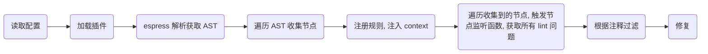

# ESLint 修复流程

> ESLint 作为能自动查找、修复代码格式问题的工具，其核心流程是怎么样的呢？本文会做对其核心流程做一个简要的说明。

说到代码检测修复，又要回到老生常谈的 AST，可以这么说：**前端工具，无论是打包的 webpack、编译的 babel，还是这里要说明的 ESLint。只要涉及到源码层面的操作，肯定都是通过操作 AST 来处理的。**

AST 这里就不再赘述了，ESLint 使用的工具是 [espree](https://github.com/eslint/espree) 来生成 AST。

```text
espress 最早是从 esprima 上 fork 出来的。最新版本是基于 Acorn，生成的 AST 结构和 esprima 是相同的，API 也相同。主要使用 parse() 和 tokenize() 这两个 API 来生成 AST 和词法单元（token）。
```

ESLint 整体的执行流程如下：




