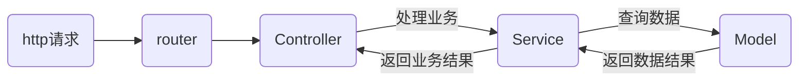

# egg.js 入门

[toc]

## 安装

```shell
npm i egg -S
npm i egg-bin -D # 本地开发、调试、测试Egg应用程序的命令行开发工具，它集成了本地调试、单元测试、代码覆盖率等。可以用来启动本地服务（官方不推荐 pm2 来管理进程）
```

开启调试服务

在 package.json 执行脚本中加入以下命令，使用 egg-bin 启动调试服务

`egg-bin dev`

## 目录结构规范

egg 规定【约束优先于配置】以方便团队内部开发，所以对项目目录有严格的规范

```text
egg-project
├── package.json
├── app.js (可选)
├── agent.js (可选)
├── app
|   ├── router.js
│   ├── controller
│   |   └── home.js
│   ├── service (可选)
│   |   └── user.js
│   ├── middleware (可选)
│   |   └── response_time.js
│   ├── schedule (可选)
│   |   └── my_task.js
│   ├── public (可选)
│   |   └── reset.css
│   ├── view (可选)
│   |   └── home.tpl
│   └── extend (可选)
│       ├── helper.js (可选)
│       ├── request.js (可选)
│       ├── response.js (可选)
│       ├── context.js (可选)
│       ├── application.js (可选)
│       └── agent.js (可选)
├── config
|   ├── plugin.js
|   ├── config.default.js
│   ├── config.prod.js
|   ├── config.test.js (可选)
|   ├── config.local.js (可选)
|   └── config.unittest.js (可选)
└── test
    ├── middleware
    |   └── response_time.test.js
    └── controller
        └── home.test.js
```

如上，由框架约定的目录：

- `app/router.js` 用于配置 URL 路由规则，具体参见 [Router](https://eggjs.org/zh-cn/basics/router.html)。
- `app/controller/**` 用于解析用户的输入，处理后返回相应的结果，具体参见 [Controller](https://eggjs.org/zh-cn/basics/controller.html)。
- `app/service/**` 用于编写业务逻辑层，可选，建议使用，具体参见 [Service](https://eggjs.org/zh-cn/basics/service.html)。
- `app/middleware/**` 用于编写中间件，可选，具体参见 [Middleware](https://eggjs.org/zh-cn/basics/middleware.html)。
- `app/public/**` 用于放置静态资源，可选，具体参见内置插件 [egg-static](https://github.com/eggjs/egg-static)。
- `app/extend/**` 用于框架的扩展，可选，具体参见[框架扩展](https://eggjs.org/zh-cn/basics/extend.html)。
- `config/config.{env}.js` 用于编写配置文件，具体参见[配置](https://eggjs.org/zh-cn/basics/config.html)。
- `config/plugin.js` 用于配置需要加载的插件，具体参见[插件](https://eggjs.org/zh-cn/basics/plugin.html)。
- `test/**` 用于单元测试，具体参见[单元测试](https://eggjs.org/zh-cn/core/unittest.html)。
- `app.js` 和 `agent.js` 用于自定义启动时的初始化工作，可选，具体参见[启动自定义](https://eggjs.org/zh-cn/basics/app-start.html)。关于`agent.js`的作用参见[Agent机制](https://eggjs.org/zh-cn/core/cluster-and-ipc.html#agent-机制)。

由内置插件约定的目录：

- `app/public/**` 用于放置静态资源，可选，具体参见内置插件 [egg-static](https://github.com/eggjs/egg-static)。
- `app/schedule/**` 用于定时任务，可选，具体参见[定时任务](https://eggjs.org/zh-cn/basics/schedule.html)。

**若需自定义自己的目录规范，参见 [Loader API](https://eggjs.org/zh-cn/advanced/loader.html)**

- `app/view/**` 用于放置模板文件，可选，由模板插件约定，具体参见[模板渲染](https://eggjs.org/zh-cn/core/view.html)。
- `app/model/**` 用于放置领域模型，可选，由领域类相关插件约定，如 [egg-sequelize](https://github.com/eggjs/egg-sequelize)。

## 开发

创建 egg 项目，需要符合上述规定的目录结构，之后就按照正常的开发逻辑开发即可。

Web 开发第一步，基于 MVC 模式，首先编写 **Controller** 和 **Router** 

#### Controller

 Controller 负责解析用户输入，处理后返回相应的结果。（业务逻辑交给 service 层，controller 负责接和发，service 层负责化。一套接化发，处理完用户的请求）

 - 在 RESTful 接口中，Controller 接受用户参数，从数据库查找数据或更新数据，并返回用户结果
 - 在 HTML 页面请求中，Controller 依据请求路径，返回不同的 HTML 模版给用户
 - 在代理服务器中，Controller 将用户请求转发到其他服务器上，并将其他服务器的处理结果返回给用户

 egg 框架推荐 Controller 处理用户的请求参数，对参数校验、转换，然后调用 service 层对业务进行业务处理，得到业务结果后封装数据并返回

 1. 获取用户通过 HTTP 传递过来的请求参数。
 2. 校验、组装参数。
 3. 调用 Service 进行业务处理，必要时处理转换 Service 的返回结果，让它适应用户的需求。
 4. 通过 HTTP 将结果响应给用户。

egg.js 中文件名很重要，**路由通过文件名来直接加载对应的 Controller 文件 **

```js
// app/controller/home.js
const Controller = require('egg').Controller;

class HomeController extends Controller {
  async index() {
    this.ctx.body = 'Hello world';
    // 如果是渲染模版文件等异步操作，需要 await，否则 ctx 为 undefined 页面 404
    // await this.ctx.render('home.ejs', { home: 'home' })
  }
}

module.exports = HomeController;
```

配置路由映射：

```js
// app/router.js
module.exports = app => {
  const { router, controller } = app;
  router.get('/', controller.home.index); // 加载 controller 下的 home.js 中的 index 方法
};
```

#### 模版渲染

由于现在大部分是前后端分离的项目，模版渲染只做简单说明。

egg 和大多数工具一样，提供了扩展能力。其扩展方式也是**类似于 webpack 的插件机制**（插件机制，yyds）。通过插件机制，我们可以引入不通的模版渲染引擎。如常用的`ejs`

首先需要安装插件

```shell
npm install egg-view-ejs -S
```

*egg 的模版渲染插件大多以`egg-view`开头*

之后需要在 config 的`plugin.ts`中配置插件

```ts
import { EggPlugin } from 'egg';

const plugin: EggPlugin = {
  ejs: {
    enable: true,
    package: 'egg-view-ejs',
  },
};

export default plugin;
```

配置插件后，还需要配置渲染的模版引擎。egg.js 使用`nunjucks`作为默认的模版殷勤，对于其他模版引擎需要在`config`中单独配置。

```typescript
// config.default.js
import { EggAppConfig, EggAppInfo, PowerPartial } from 'egg';

// 提供给 config.{env}.js 使用
export type DefaultConfig = PowerPartial<EggAppConfig>;

export default (appInfo: EggAppInfo) => {
  const config = {} as PowerPartial<EggAppConfig>;
  config.keys = appInfo.name + '_liaoyk';
  config.view = {
    defaultViewEngine: 'ejs',
    mapping: {
      '.ejs': 'ejs',
    },
  };
  return config;
};
```

最后在 controller 中使用`ctx.render`渲染即可，记得使用`await`等待渲染完成，否则页面 404。

#### 静态资源

正如`express.static`支持直接代理静态资源文件一样，egg 也内置了静态资源文件的支持插件`egg-static`，默会把`app/public`目录映射到`/public`路由上。

如`app/public/static.html`，在启动服务后，访问`http://xxxx/public/static.html`即可访问该静态资源文件。

**注意：**

- `static` 插件，线上会默认设置一年的 `maxAge` 
- 框架默认开启了 CSRF 防护，故 `AJAX` 请求需要带上对应的 `token ` 

#### 配置文件

在运行时可以通过`app.config.env`获取当前运行环境的变量

| serverEnv | NODE_ENV   | 说明         |
| --------- | ---------- | ------------ |
| local     | -          | 本地开发环境 |
| unittest  | test       | 单元测试环境 |
| prod      | production | 生产环境     |

框架会根据不同的运行环境来加载不同的配置文件。

```text
showcase
├── app
└── config
    ├── config.default.js
    ├── config.prod.js
    ├── config.unittest.js
    ├── config.default.js
    └── config.local.js
```

- `config.default.js` 为默认的配置文件，所有环境都会加载它，**绝大部分配置应该写在这里**。
- 然后会根据运行环境加载对应的配置，并覆盖默认配置的同名配置。
  - 如 `prod` 环境会加载 `config.prod.js` 和 `config.default.js` 文件。然后 `config.prod.js` 会覆盖 `config.default.js` 的同名配置。

配置文件支持三种写法：

- `module.exports` 返回一个对象
- `exports.key = value` 单独配置的形式
- `module.exports = appInfo => { }` 以函数的形式，其中 appInfo 
  - pkg: package.json
  - name: pkg.name
  - baseDir: 应用代码根目录
  - HOME: 环境中的 HOME 目录，如 `/home/admin`
  - root: 应用根目录，local 和 unittest 环境下为 baseDir，其他为 HOME

#### Service

service 层一般用来编写具体的业务逻辑供 controller 调用

我们在`app/service`中编写对应的逻辑

```typescript
// app/service/todo.ts

import { Service } from 'egg';

export default class TodoService extends Service {
  public async creat(todo): Promise<Todo> {
    todo.id = Date.now().toString();
    todo.completed = false;
    return todo;
  }
}

export interface Todo {
  id: number,
  title?: string,
}
```

在 controller 中调用

```typescript
// app/controller/home.ts
import Index from './index';

export default class Home extends Index {
  async create() { 
    const { ctx, service } = this // service 层也在 this 中暴露
    ctx.status = 201
    ctx.body = await service.todo.creat(ctx.request.body) // 调用即可
  }
}
```

到这里也可以明确整个 **web 请求处理的流程**：



#### RESTful

对 RESTful 风格的请求，egg 也提供了内建支持

我们可以使用`router.resources`来映射 RESTful 路径（简化路由文件），也可以直接在路由中写明地址和对应的 Controller

**使用`router.resources`** 

`router.resources([router-name, ] path, [middlewares, ]controller)` 

```typescript
module.exports = (app) => {
  const { router, controller } = app;
  router.resources('/api/search', controller.search);
};
```

在`app/controller/search`中

```typescript
import Index from './index';

export default class Search extends Index {
  // get /api/search
  async index() {
    const { ctx } = this;
    const name = ctx.query.name // /api/search?name=test 获取 get 参数，自由传参
    // const name = ctx.params.name // /api/search/:name 获取 get 参数，路径传参
    ctx.body = '123';
    ctx.set('content-type', 'application/json');
  }

  // post /api/search
  async create() {
  	const data = ctx.request.body // 获取 post 参数
  }

  // put /api/search
  async update() { }

  // delete /api/search
  async destroy() { }
}
```

**也可以在路由中直接使用`router.get`，`router.post`等方法** 

####  单元测试

Web 应用中的单元测试非常重要，框架也提供了对应的单元测试能力支持。

```js
// test/app/controller/todo.test.js
const { app, mock, assert } = require('egg-mock/bootstrap');

describe('test/app/controller/todo.test.js', () => {
  it('should add todo', () => {
    return app.httpRequest()
      .post('/api/todo')
      .send({ title: 'Add one' })
      .expect('Content-Type', /json/)
      .expect('X-Response-Time', /\d+ms/)
      .expect(201)
      .expect(res => {
        assert(res.body.id);
        assert(res.body.title === 'Add one');
        assert(res.body.completed === false);
      });
  });
});
```

## 调试

egg-bin 集成了调试功能，使用`egg-bin debug`启动项目即可开启调试模式

## 本地开发

- egg-bin 工具提供了热更新能力，非常方便。如果使用 express 之类的框架还需要自己配置热更新。
- egg-bin 自动生成 d.ts 文件，方便 ts 开发

## ts 开发

egg.js 内置了 ts 开发的支持，主要通过自动生成 `d.ts`文件。同时运行时通过 `ts-node`提供支持，这些工具也被继承到了`egg-bin`中

我们需要在开发时在`package.json`中配置以下两个字段

```json
{
  "egg": {
    "typescript": true, // 开启 ts-node ts-loader 支持
    "declarations": true // 开启自动 d.ts 文件生成
  }
}
```

自动`d.ts`文件生成依赖于 ts 的  [Declaration Merging](https://link.zhihu.com/?target=https%3A//www.typescriptlang.org/docs/handbook/declaration-merging.html) 特性，同时灰度去 JSDoc 注释，所以 JSDoc 注释很重要。

可以参考 egg 作者的这篇文章：https://zhuanlan.zhihu.com/p/56780733
