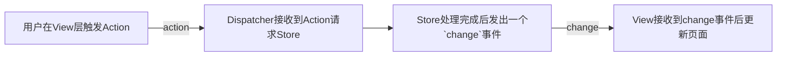

# redux

react 的状态管理器 redux，基于发布订阅模式。

vue 的 vuex 是一个全局单例。

[toc]

在学习 redux 之前我们先要了解一种架构思想—— Flux。他和 MVC 这种思想是一类东西，但更加简单和清晰。

## Flux

Flux 存在[多种实现](https://github.com/voronianski/flux-comparison)，这里说明 Facebook 的官方实现（和 Redux 的具体实现不太一致）。

和 MVC 这类架构一样，Flux 也将应用分层

- **View**： 视图层，不含任何状态
- **Action**（动作）：视图层发出的消息（比如mouseClick）
- **Dispatcher**（派发器）：用来接收Actions、执行回调函数
- **Store**（数据层）：用来存放应用的状态，一旦发生变动，就提醒Views要更新页面

Flux 最大的特就是单向数据流（这也是 react 的一大特点）



在我们使用 react hook 提供的 `useReducer` 的时候就能感受到这种模式。

这种模式的优点就是解构清晰，有一种链式调用的意味。数据层和视图层也通过事件订阅模式来解耦。优点很明显，缺点则是1）带来了开发的心智负担，需要开发清楚其中的实现；2）单一的数据流向在组件层次很深的时候传递麻烦；


## Redux

redux 则是遵从 flux 思想的工具（vuex 似乎也是？）。

redux 三大原则：

1. state 以单一对象存储在 store 对象中
2. state 只读，每次都返回一个新的对象（这里有个疑问，既然 state只读，那么如何更新全局状态呢？）
3. 使用纯函数 reducer 执行 state 更新

#### redux 工作流

redux 的一般工作流如下

 

下图是官网的流程说明：

 

可以看到 hooks 中的 `useReducer` 和这个流程是一摸一样！

#### 安装

```shell
npm i redux -S
```

一般在项目的 redux 目录下创建 store 实例。

#### 使用

##### 老方法

1. 创建 store 实例，同时在这里声明 reducer

```react
// redux/store.js
import { createStore } from 'redux'

const state = {
  show: true
}

const reducer = (prevState = state, action) => {
  console.log('action', action)
  // ....
  return prevState
}

const store = createStore(reducer)

export default store
```

2. view 层触发 dispatch（**`type`关键字是固定的，传值的 key 则无要求**）

```react
import store from '../redux/store'

useEffect(() => {
  store.dispatch({
    type: 'hide-tabbar'
  })

  return () => {
    store.dispatch({
      type: 'show-tabbar'
    })
  }
}, [])
```

3. store 中通过 reducer 更新状态并返回
4. 在需要的 view 层订阅更新。**使用`store.getState()`方法手动获取数据**

```react
const getStoreIsShow = () => {
  return store.getState().isShow
}
const [isShow, setIsShow] = useState(getStoreIsShow())

useEffect(() => {
  store.subscribe(() => {
    setIsShow(getStoreIsShow())
  })
}, [])
```

这里最反直觉的一点是可能会觉得更新后的状态应该从 `subscribe` 的回调函数返回回来才对（个人觉得是为了更方便的处理异步的问题而这么设计的）。

##### 新方法

官方文档上现在更推荐使用 redux toolkit 来创建 store 。

安装：`npm install @reduxjs/toolkit`

按照官方的说法：

```text
We specifically created Redux Toolkit to eliminate the "boilerplate" from hand-written Redux logic, prevent common mistakes, and provide APIs that simplify standard Redux tasks.
```

就是该工具可以简化 redux 的编写，并且处理了一些公共错误。

下面是一个官方示例：

```react
import { createSlice, configureStore } from '@reduxjs/toolkit'

const counterSlice = createSlice({
  name: 'counter',
  initialState: {
    value: 0
  },
  reducers: {
    incremented: state => {
      // Redux Toolkit allows us to write "mutating" logic in reducers. It
      // doesn't actually mutate the state because it uses the Immer library,
      // which detects changes to a "draft state" and produces a brand new
      // immutable state based off those changes
      state.value += 1
    },
    decremented: state => {
      state.value -= 1
    }
  }
})

export const { incremented, decremented } = counterSlice.actions

const store = configureStore({
  reducer: counterSlice.reducer
})

// Can still subscribe to the store
store.subscribe(() => console.log(store.getState()))

// Still pass action objects to `dispatch`, but they're created for us
store.dispatch(incremented())
// {value: 1}
store.dispatch(incremented())
// {value: 2}
store.dispatch(decremented())
// {value: 1}
```

可以看到使用新方法确实使代码可读性提高了，写起来也更加简单，我们不需要每次都去复制一遍老状态再返回，更符合编程逻辑。

##### 取消订阅

上面我们在需要的 view 层中订阅了更新，如果我们想要取消订阅，比如在组件销毁时取消该如何处理呢？

`dispatch` 方法有一个返回值，是一个函数，执行该函数即可取消订阅。

```js
const unSubscribe = store.subscribe(() => {
  console.log('456')
  setCinemas(store.getState().CinemasReducer.allCinemas)
})

unSubscribe()
```

#### 结构优化

**在上面 view 层触发的时候，我们可以进行一些解耦的设计。以符合 redux 的一般工作流**

要触发的 type 我们最好单独配置，这样方便后期或者和修改。（就像 vuex 的 state 名我们一般采用常量映射的方式，因为其他地方也会用到，这时候只要饮用 key 名相同即可）

这也就是 redux 工作流中 `Action Creators` 的用处

 

```react
// TababrActionCreators.js
function isShow () {
  return {
    type: 'show-tabbar'
  }
}

function hide () {
  return {
    type: 'hide-tabbar'
  }
}

export { isShow, hide }

/*===== view ====*/
store.dispatch(hide()) // 实现解耦，也更符合 redux 的设计理念
```

**同时 reducer 中的逻辑也比较混乱，特别是数据多的话维护起来会很麻烦。不符合封闭原则。所以官方提供了`combineReducer`这个方法让我们可以将拆分的 reduer 合并。**

```react
import CityReducer from './CityReducer' // redux/reducer/CityReducer.js

const TabbarReducer = (prevState = state, action) => {
  const newState = { ...prevState }
  switch (action.type) {
    case 'hide-tabbar':
      newState.isShow = false
      break
    case 'show-tabbar':
      newState.isShow = true
      break
  }
  return newState
}

// 合并两个 reducer
const reducer = combineReducers({ 
  TabbarReducer,
  CityReducer
})
```

这样各自的 reducer 就只需要管自己的了，初始化状态也只需要初始化自己要的。

但是取的时候要注意，就和 vuex 的 modules 一样，取的时候要到各自 modules 里去取

```react
this.state = {
  cityName: store.getState().CityReducer.cityName // 到具体的 modules 中去取
}
```

#### 原理

redux 的核心是一个标准的发布订阅模式的实现。下面是其简易的实现：

```react
function createStore(reducer) {
  const list = []
  const state = reducer()
  function subscribe(callback) {
    list.push(callback)
  }
  function dispatch(action) {
    state = reducer(state, action) {
      for (let i in list) {
        list[i]
      }
    }
  }
  function getState() {
    return state;
  }
  return {
    subscrube,
    dispatch,
    getState 
  }
}
```

所以这个东西不仅能在 redux 中用，也可以在其他框架中使用！

redux 将数据存在内存中，所以刷新页面数据会丢失（vuex 也一样）。所以如果想要保存数据如何处理呢？很容易想到的就是 `localStorage`。那么流行的方案是如何处理的呢？可以看一下后面的 redux 持久化缓存。

## redux 中间件（异步处理）

上面我们说的都是处理同步问题，那么 redux 是如何处理异步问题的呢？

```text
就 redux 本身而言，Redux store 对异步逻辑一无所知。它只知道如何同步 dispatch action，通过调用 root reducer 函数更新状态，并通知 UI 某些事情发生了变化。任何异步都必须发生在 store 之外。
```

下面是官方异步问题处理流程图：

 

可以看到 redux 是依赖 redux-thunk 这个中间件去处理异步请求，中间件处理完成后再次 dispatch 通知 reducer 更改。

所以我们需要了解一下 redux-thunk。

#### redux-thunk

先来思考一个问题，一个列表数据有多个页面在用，我们需要第一次请求的时候就把数据缓存到 redux 中，防止不必要的多次请求，如何处理？

在 vuex 中我们会写一个  action ，然后页面在初始化时都调用这个 action 即可。

在 redux 中有类似 action 的方法吗？难道我们需要把取数方法每个组件都写一遍吗？还是单独写个工具方法来处理？都不符合 redux 的流程，脱离了 redux 本身。

前面我们使用了 actionCreator 来优化项目结构，那么我们可以在其中来处理复杂逻辑，比如请求数据。但是因为请求是异步的，最后 `return` 的是 `undefined` ，react 会报错。怎么办呢？

这就轮到 redux-thunk 来处理了。

##### 安装

```shell
npm i react-thunk -S
```

##### 原理

接入了 redux-thunk 之后，actionCreator 可以接收一个函数。同时给该函数传入 `dispatch`、`getState` 方法。

基本实现如下：

```js
export default function thunkMiddleware({dispatch, getState}) {
  return next => action => 
  	typeof action === 'function' ? // 如果是函数则再执行
    	action(dispatch, getState) :
  		next(action)
}
```

##### 使用

1. 在 store 中配置该中间件，**使用`applyMiddleware` 方法接入中间件**

   ```javascript
   import { createStore, combineReducers, applyMiddleware } from 'redux'
   
   const store = createStore(reducer, applyMiddleware(reduxThunk))
   ```

2. 在 actionCreators 中声明，返回一个函数，redux-thunk 会给该函数传入 dispatch 方法

   ```js
   function getCinemasAction () {
     return (dispatch) => axios
       .get(
         'https://m.maizuo.com/gateway?cityId=110100&ticketFlag=1&k=5328918',
         {
           headers: {
             'X-Client-Info': JSON.stringify({
               a: '3000',
               ch: '1002',
               v: '5.2.0',
               e: '1657678965863782347735041',
               bc: '110100'
             }),
             'X-Host': 'mall.film-ticket.cinema.list'
           }
         }
       ).then(res => {
         const { data } = res.data
         dispatch(setAllCinemas(data?.cinemas || []))
       })
   }
   ```

3. 在要获取数据的地方调用和订阅

   ```js
   import store from '../redux/store'
   
   store.dispatch(getCinemasAction()) // 调用该方法获取数据
    
   store.subscribe(() => { // 订阅，获取到数据后修改状态
     this.setState({
       allCinemas: store.getState().CinemasReducer.allCinemas
     })
   })
   ```

上面就是 react-thunk 的用法。如果我们不喜欢这种风格，也可以使用 redux-promise 中间件来使用 promise 风格的代码。

#### redux-promise

redux-promise 的使用与 redux-thunk 大致相同。只有在 actionCreator 中使用的是 promise 风格。

举个🌰：

```js
function getCinemasAction () {
  return axios // 返回一个 promise 对象
    .get(
      'https://m.maizuo.com/gateway?cityId=110100&ticketFlag=1&k=5328918',
      {
        headers: {
          'X-Client-Info': JSON.stringify({
            a: '3000',
            ch: '1002',
            v: '5.2.0',
            e: '1657678965863782347735041',
            bc: '110100'
          }),
          'X-Host': 'mall.film-ticket.cinema.list'
        }
      }
    ).then(res => {
      const { data } = res.data
      return { // 直接和 dispath 一样 return 即可
        type: 'set-all-cinemas',
   			payload: data?.cinemas || []
      }
    })
}
```

redux-promise 在返回的 promise 执行完后，接收返回值，然后自动 `dispatch` 出去。

#### 多个中间件

上面我们只使用了一个中间件，直接作为第二个参数传入了进去。如果有多个中间件呢？传入了多个参数吗？

不是的，redux 提供了一个`componse`方法来组合参数，多个中间件使用`compose`组合后再传入。

```react
import { createStore, applyMiddleware, compose } from 'redux'

const store = createStore(
  reducer,
  compose(
  	applyMiddleware(...middleware)
  )
)
```

## react-redux

上面的内容其实和 react 都没关系，是用纯 js 实现的。在 react 中使用的是还有一些繁琐的地方，比如需要我们手动订阅变化，手动取消订阅.....

react-redux 则对这些繁琐的操作做了一层包装，方便我们使用。一般的工程中我们也使用它来进行状态管理，但记住他是基于 redux 的。下面来看看他的使用。

**安装**

```shell
npm i react-redux -S
```

#### 使用

react-redux 通过高阶组件的形式对根组件进行包装。

核心是两个高阶组件

- `<Provider />`
- `<Connect />`

**store 的声明和 redux 一样**，主要是数据的订阅和分发不再使用 subscribe 和 dispatch 而是依赖于上面两个组件！

`<Provider />` 将根组件放入 Provider 的 slots 中，完成包装，让所有子组件都能拿到 store 状态

```js
import { Provider } from 'react-redux'

ReactDOM.render(
  <Provider store={store}>
    <App />
  </Provider>,
  document.getElementById('root')
)
```

**`<Connect />`** 

该组件接收四个参数：

1. mapStateToProps `(state, ownProps?) => Object` 将 redux 中规定状态映射到被包裹的组件的 props 中，不需要则填` null`
2. mapDispatchToProps  `Object | (dispatch, ownProps?) => Object` 更新 store 状态，接收一个对象或者一个函数，且返回的对象的每一个属性都需要是一个函数。调用时会获取函数的返回值作为 Action 交给 reducer 处理
3. mergeProps `(stateProps, dispatchProps, ownProps) => Object` 决定如何合并父组件传入的 props 和 react redux 传入的 props，默认是 `{ ...ownProps, ...stateProps, ...dispatchProps }`
4. options `Object` 仅在 v6.0 以上提供

下面是 mapStateToProps 的🌰

```js
export default connect((state) => {
  return {
    prop1: 1,
    prop2: 2,
    cityName: state.CityReducer.cityName
  }
})(App) // 注意这里要将组件包装传入
```

这样在 `<App />`这个组件的 `props` 中拿到传入的这些参数。除了返回的参数之外，还会传入一个`dispatch`方法，作用和 redux 的 `dispatch` 方法相同！

下面是 ma pDispatchToProps 的🌰

```js
export default connect(null, {
  fn1: () => {
    console.log('fn1')
  },
  fn2: () => {
    console.log('fn2')
  },
  change: () => {
    return {
      type: 'CHANGE'
    }
  }
})(City)

// 这样在 City 组件中可以使用 props.fn1 来调用该函数，触发父组件的方法！
```

异步更新的处理方式和 redux 一致，依然要依赖上面的这些中间件！

#### react-redux vs redux

react-redux 这样一看和 redux 区别不是很大，那 react-redux 提供了哪些东西呢？

1. “响应式”的数据。如果使用 redux 在我们更改数据之后，我们需要在组件每次初始化的时候重新手动去取一遍。而通过 react-redux 高阶组件的包装，数据直接从 props 中来。我们也知道 props 更新组件会自动重新渲染！


#### 原理（HOC）

首先 react-redux 提供的 `<Provider />` 和 `<Connect />` 是两个高阶组件，这是 react 中普遍的扩展组件功能的方式，在 vue 中有聊过。实际上在 react 中更合适用这种方式来扩展组件功能！

比如通过 HOC 的形式将 404 页面包转一下，传入自定义参数，🌰：

```react
function HOCNotFound (cb) {
  const value = cb()
  // 自定义参数
  const myProps = Object.assign(
    {},
    {
      title: '404'
    },
    value
  )
  // 记住 react 组件最后导出的是一个函数
  // 记住 react 组件最后导出的是一个函数
  // 记住 react 组件最后导出的是一个函数
  return (Component) => (props) => {
    // console.log(props, 'new not found props')
    return <Component {...myProps} {...props} />
  }
}

/*========== 使用 ===============*/
export default HOCNotFound(() => ({
  Hoc: 'hoc'
}))(NotFound)
```

在使用时将要包装的组件传入，**注意使用时函数执行了两次（`fn()()`）**，所以在执行两次之后仍然要返回一个函数，才符合 react 组件的规范。

这种方法主要还是用于

1. 扩展功能
2. 复用粒度更低的组件
3. 渲染拦截，在外层包裹 DOM 再渲染

react-redux 实际上就是在内部有这样一个方式的实现！

#### 持久化缓存

vuex 可以使用持久化缓存的一些工具将数据缓存在 localStorage 中，在需要时通过 vuex 提供的 API ` replaceState ` 来恢复数据。

react-redux 也有持久化缓存的工具—— redux-persist

```shell
npm i redux-persist -S
```

**使用**

```js
import { persistStore, persistReducer } from 'redux-persist'
import storage from 'redux-persist/lib/storage'

const persistConfig = {
  key: 'root', // localStorage 中存的key: persist:root
  storage
}

// reducer 持久化
const persistedReducer = persistReducer(persistConfig, reducer) // reducer 是原来的
const store = createStore(
	persistedReducer, // 使用持久化后的 reducer 来创建 store
	applyMiddleware(reduxThunk),
)

const persistor = persistStore(store)
export {
  store, 
  persistor
}
```

如上配置好后即可使用了

下面是一些其他配置说明

- 选择性缓存（whiteList、blackList）：redux-persist 默认缓存整个 store，如果我们只想缓存部分值可以使用白名单和黑名单的策略

  ```js
  const persistConfig = {
    key: 'root', // localStorage 中存的key: persist:root
    storage,
    whitelist: ['CityReducer'] // 只缓存 CityReducer 中的状态
  }
  ```

- storage

  - 在 web 浏览器中推荐使用 `redux-persist/lib/storage` ，实际上就是使用 localStorage
  - **sessionStorage** `import storageSession from 'redux-persist/lib/storage/session'`
  - **AsyncStorage** react-native `import AsyncStorage from '@react-native-community/async-storage'`

  

**注意点**

在使用的时候要注意，redux-persist 读取缓存`REHYDRATE`的时候是改变了原来初始状态的值。**这个过程是异步的**。

如果在此期间有下面这样的写法，会导致 `state` 对象的指向变更，无法拿到缓存的值！

```js
const OtherReducer = (prevState = state, action) => {
  // ...
  let newState = { ...prevState }
  // ...
  return newState
}
```

所以尽量使用下面这种写法

```js
const OtherReducer = (prevState = state, action) => {
  switch (action.type) {
    case 'change-city':
      return { ...prevState, ...{ cityName: action.payload } }
  }
  return prevState // 默认返回原始值
}
```

