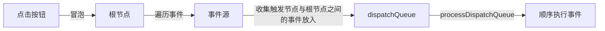

# React 入门

在开发 vue 的过程中我经常遇到这类问题：设计模式无法很好的应用，举个例子我想使用自定义的状态模式，却发现 vue 本身就自带这种模式，`data`本身就是存储了状态。但是我们真的需要把这些状态一直保留吗？我觉得不必。这个问题简单来说就是  vue 对函数式编程不更友好，逻辑堆砌在一起很容易产生 shit 代码。

*ps：我的 react 学习会结合 vue 对比，来加快学习速度，所以文章中会存在和 vue 的各种对比，但记住 **react 和 vue 不一样***

[toc]

**react 具有以下特点**

- 声明式设计 - 采用声明范式描述应用
- 函数式编程
- 组件化
- 单向数据流 - 数据可传递，同时单向也能防止数据混乱。和 vue 的 props 基本一致
- 虚拟 dom - vue 就是和 react 学的。vue 计划未来推出无虚拟 dom 的模式，因为有虚拟 dom 就需要打包进更多的框架代码来解析，而最新流行的 solid.js、svelte.js 都是无虚拟 dom 的，代码会被直接编译成浏览器认识的 html 字符，这样打包后代码体积更小，网站打开速度也更快。 react 由于自身特性暂时没办法这么做，依然使用虚拟 dom。当前 react 和 vue 都是使用 diff 算法来进行虚拟 dom 的更新。

其中和 vue 相比最特别的一点就是它是完全的函数式编程概念。加上其 jsx 语法，让我们也能很轻松的编写页面。

react 既不是 MVC 也不是 MVVM，只能算是 V 层的框架。

**react 哲学：如无必要，勿增实体！**

即如果原生方式可以实现，react 不会增加多余的方法。比如 vue 中很方便的`v-for`、`v-if`...这些在 react 中都需要你手动实现。

## 项目结构

react 有两个核心依赖

1. react - react 的顶级库
2. react-dom - react web 端的运行环境，如果是在移动端就是 react-native。可以使用 `ReactDOM.render(string, HTMLDOM)`来渲染到页面中。

还有一个依赖用于运行和打包 react，类似于 vue-cli-service

- react-scripts

```text
react-get-started
├─ README.md
├─ package-lock.json
├─ package.json // 安装上述三个依赖，如果不是脚手架安装到还需要配置 webpack
├─ public
│  ├─ favicon.ico
│  ├─ index.html
│  ├─ logo192.png
│  ├─ logo512.png
│  ├─ manifest.json
│  └─ robots.txt
└─ src
   └─ index.js // 入口
```

## 第一个程序

一般使用官方的脚手架来安装，类似 vue cli 创建一个 vue 项目自带了很多配置，react 脚手架创建 react 项目也自带了很多配置。

**默认的 entry 是 index.js**。

```react
import React from "react"; // 在 react@^17 之后就不需要引入了，但是目前大部分项目还是 16 ，这里要记一下
import ReactDOM from 'react-dom'

ReactDOM.render(
  <div>sss</div>, // 如果是 dom 不要引号，ReactDOM 可以直接解析 JSX
  document.getElementById('root')
)
```

可以看到上面最重要一点是 react 能直接解析 jsx 语法。所以这里对 jsx 进行一个简单介绍

#### JSX

jsx = javascript + xml 

jsx 将 HTML 语法直接加入到 javascript 中，**通过 babel 的 jsx 编译器转换为 js**。最终实际打包的项目中都已经被转换为了 js，没有 jsx 了。

在 react 中和 vue 中类似，都是调用了一个渲染函数`createElement`，接收一个描述 dom 的对象，生成 vDom，最后转换成真实的 dom。

所以上面的 jsx 写法实际上会被 babel 的 jsx 编译器转换成下面这种写法

```js
import React from "react";
import ReactDOM from 'react-dom'

ReactDOM.render(
  React.createElement('div', {
    id: 'test',
    class: 'test'
  }, '内容'),
  document.getElementById('root')
)
```

*这也解释了为什么需要显示的引入`React`，不过在 17 之后会在编译的时候自动引入*

react 中的 jsx 解析和 vue 的 template 有一些相似之处

- **和 vue2 一样 react jsx 一个组件只能有一个根 dom，多个会报错** 
- **如果想返回多个元素，可以使用`<> </>`当做根标签，**解析的时候不会被渲染。类似于 vue 的 `template`标签。实际上是`<React.Fragment>`的简写。

## React 中的组件

react 中的组件都要继承自`React.Component`，并在子类中重写父类的`render`方法

组件分为

- 类组件
- 函数式组件

#### 类组件

```react
import { Component } from "react";

class App extends Component {
  render () {
    return <div>hello react Component</div>
  }
}
export default App
```

`render`方法返回要渲染的 jsx 结构，**和 vue 一样，根 dom 节点只能有一个**

之后同样适用`ReactDOM.render`函数渲染即可

```js
import React from "react";
import ReactDOM from 'react-dom'
import App from './01-base/01-class' // 引入 注意这里一定要首字母大写，react 要用来和原生标签作区分

ReactDOM.render(
  <App />, // 渲染，render 方法会自动实例化类并调用实例化后对象的 render 方法
  document.getElementById('root')
)
```

实际上 react 会帮你做这样一件事

```react
const app = new App({name: 'react'}).render()
ReactDOM.render(app, document.getElementById('root'))
```

#### 函数式组件

vue 中也有函数式组件， 不会被初始化为 vue 实例，相当于所有的配置都是静态的（**无状态的**），只用来渲染。react 中的作用也是相同的

```react
function App () {
  return (
    <div>
      hello functional Component
    </div>
  )
}

export default App
```

在现代工程中基本都是使用的函数式组件。

**函数式组件在 react < 16.8 都是无状态的和 vue 相同，但是在 react hooks 引入之后可以给函数式组件以状态了。函数式组件才开始在现代工程中到处都是，写起来也比类组件简单也更符合函数式编程！！！**

所以注意 16.8 版本的 react 是一个分水岭！之前要保留状态还是老老实实写类组件。现在就直接函数式组件即可

#### 组件引入

我们当然也可以在一个组件中引入另一个组件，这和直接在根组件中引入组件是相同的

```react
import ClassApp from './01-class'
/**
 * 函数式组件
 */

function App () { // 直接引入另一个组件并使用即可
  return (
    <div>
      hello functional Component
      <ClassApp />
    </div>
  )
}

export default App
```

类组件和函数式组件可以互相引入没有影响。

但是这里不能直接往嵌套的组件中再放入 dom，也不能像 vue 的 `slot`一样处理！

```react
// ...
function App () { // 直接引入另一个组件并使用即可
  return (
    <div>
      <ClassApp>
      	<div>test</div>
      </ClassApp>
    </div>
  )
}
// ...
```

即这样嵌套是不行的**，按照 react 的设计原则，这种嵌套的组件应该放在这里的`ClassApp`下而不是在父级引入**。虽然这样会有点不方便，即无法轻松的使用父组件的变量作用域，但是会让项目结构更加清晰。

不过如果真的想这么做也能做到，后面会说！！！

#### 组件的样式

在 vue 中我们通常使用 SFC，css 和 template 是分开的，但是在 react 中一般是 css in js，如何处理呢？

首先我们要知道在 react 中如何使用表达式

- 在 vue 中`{{ }}`在 template 中声明一个表达式，vue 也会把 `{{ }}`的内容当作表达式解析
- 在 react 中则使用 `{}`单大括号即可

在 jsx 中不支持直接使用 style 写样式，必须要作为一个对象传入

```react
import { Component } from 'react'

export default class Css extends Component {
  render () {
    const style = {
      background: 'yellow',
      height: '100px',
      width: '100px'
    }
    return ( // 将 style 作为对象传入，同时使用 {} 解析
      <div>
        <div style={style}></div>
      </div>
    )
  }
}
```

我们更推荐将 css 写入单独的模块，这样可以更好的复用 css。也是 react 推荐的做法！

同样我们也可以定义类名，然后引入整个 css 样式文件，**注意 jsx 中的 class 为了区分原本的 html 标签要写成 `className`**（在 react 16.2 之前写 class 会直接失效，不过之后就算写 class 也会生效，但是仍然会有警告。更推荐 className ）

```react
import { Component } from 'react'
import './css/01-index.css' // 交给 webpack 处理，最终通过 css-loader、style-loader 插入 header 

export default class Css extends Component {
  render () {
    return ( // 注意这里的 className
      <div>
        <div className="active"></div>
      </div>
    )
  }
}
```

**除了 class 还有一些其他的 DOM 原生 property，在 jsx 中需要特殊声明：** 

- class -> className
- label 标签的 for 属性 -> htmlFor

##### 一些注意事项：

- **在 react 中推荐使用行内样式，因为 React 觉得组件应该是一个整体，不应该把 css 放在外部的地方。放在一起有利于在其他地方复用的时候直接引入组件即可，不需要再额外引入样式。** 

- 在 jsx 中要写**注释**需要用`{}`框起来，让 react 认为这是 js 表达式，在用 js 相同的注释方式即可

  ```react
  import { Component } from 'react'
  
  export default class Css extends Component {
    render () {
      const name = 'test'
      return (
        <div>
          {/* 注释，注意不要双斜线，会让后面的括号也失效 */}
          {10 + 20} { name }
        </div>
      )
    }
  }
  ```

- **样式需要在 jsx 解析的时候就获取到，所以1、不能是异步的；2、如果是函数必须同步执行并返回**（即只能是`this.xxxx()`，不能和事件绑定一样没有执行标志`()`）

## 在 jsx 绑定事件

在 jsx 中绑定事件很简单，就像传入样式一样，**使用`{}`即可**

```react
import React, { Component } from 'react'

export default class EventComponent extends Component {
  render () {
    const add = () => {
      // dosth
    }
    return ( // 直接使用 {} 传入方法即可
      <div>
        <input />
        <button onClick={add}>add</button>
      </div>
    )
  }
}

```

**注意点：** 

- 最好传入的方法是箭头函数，保持上下文的 this 指向一致。**箭头函数 this 指向组件实例，**可以获取到组件上的参数。普通函数在 onClick 事件触发下本应指向按钮这个 dom 元素。但这里不是 html 而是 jsx，相当于函数直接调用，this 指向 `undefined`。

回顾一下上面 jsx 实际的执行过程

`new XXXX().render()`，所以 render 中的 this 是指向组件实例本身不奇怪。也正是因为此，我们不仅可以像上面一样在`render`函数中定义方法，也**可以直接在类上定义实例方法，然后直接通过 `this.xxxx`调用。这才是正常项目中的写法。上面在 render 中定义不推荐。** 

```react
import React, { Component } from 'react'

export default class EventComponent extends Component {
  render () {
    return (
      <div>
        <button onClick={ this.handleClick }>add2</button>
      </div>
    )
  }

  handleClick () {
    console.log('handleClick')
  }
}
```

**react 绑定事件和 vue 的一点区别**

- vue 可以定义事件然后传参数`handleClick('arg')`，但是 react 的 jsx 中不行，因为 jsx 会被直接解析赋值给 dom 元素的事件。如果这样写函数会在解析的时候直接执行。
- 如果真的想要传参，也不是不行。直接给`{}`内写入一个**箭头函数**（普通函数会存在 `this` 指向问题）。在箭头函数中再调用我们的方法传参即可`onClick = { () => this.handleClick('arg') }` 。**这样写的话`handleClick`无论是箭头函数还是普通函数声明其 this 都会指向组件实例！**可以自己理解下就知道原因。 

记住这一点，记住这一点，记住这一点！！！重要的事情说三遍！

**原生的 event 对象还在吗？**

在 react 的 jsx 中给 dom 绑定了元素，那 event 对象还在吗？在 vue 中可以手动使用`$event`显示传递。**在 react 会将 evnet 作为第一个参数，不过这个 evnet 不是原生一样的而是 react 包装过的，但是基本具有原生相同的所有属性！** 

#### jsx **事件**中的 this 问题

同样这里还是要注意 this 

- 如果是普通函数就像上面的`handleClick`，他的函数上下文仍然是`undefined`。可能有点疑惑的是这里的`handleClick`明明是`this`（当前组件实例）当作方法调用的啊。它的`this`不应该也指向当前组件实例吗？查看函数调用栈会发现在执行事件时，react 将函数的上下文通过`apply`方法绑定到了`context`上，而这个`context`是写死的`undefined`，这就让我更疑惑了？？？为什么 react 要这样做呢？

这里要说明两点

1. 如果`{}`内就是一表达式，那么他在`new XXX().render`的时候就会执行，那么`this`很明显的就是指向当前组件实例
2. 如果`{}`传入的是一个事件，就像`onClick={ this.handleClick }`一样，那么最终在执行的时候`this.handleClick`会被赋值给`fn`。所以最终的调用是`fn.apply(context, funcArgs)`。假设没有这个`context`，函数直接调用，`this`肯定是指向`undefined`（严格模式下）。

但似乎还是没说明为什么 `context`要写死成 `undefined`？？？按照我个人的理解不是 react 不想绑定到当前组件实例而是它做不到。在调用栈中可以看到，调用事件的时候，**dom 及其绑定的事件被存储到了一个对象上。最终我们调用事件的时候是调用这个对象上的方法，而他和原来的组件已经没有任何关系了**，所以 react 也不知道原来的组件是谁，只关注怎么执行。所以这里的`context`也只能写死`undefined`。~~**以上个人理解，真实原因待看源码！**~~

**经过和同事交流得出以下结论：**

首先不要把 vue 的思维带入 react，react 中是不会保存组件实例的状态的。不像 vue 遍地都是组件实例，这里各有各的好。

也正是因为 react 没有保存组件实例，在后面我们调用事件的时候，react 不知道当前事件属于哪个组件，和我们猜想的一样！那这里有两个问题：

1. 为什么使用箭头函数可以呢？

   这是因为 babel ，在我们使用 ES6 声明对象类的时候，如果使用了箭头函数会被 babel 编译以绑定 this。具体可以看[这篇文章](https://babeljs.io/blog/2015/07/07/react-on-es6-plus)的 《Arrow Function》章节

2. 既然没有保存组件实例，那么最终我们的方法挂在哪个对象上了呢？

   这就要提到 react 中一个重要的概念——**合成事件**。

#### 合成事件

当 `ReactDOM.render` 时，将会在创建根节点 `Fiber` 时（`createRootImpl`），对所有可监听的事件进行注册（`listenToAllSupportedEvents`）。

*这也是和原生事件的区别，**react 会把事件代理到根节点**而不是绑定在具体的 dom 元素上。可以通过 devtools 的 event listener 查看。可以很大程度节省内存*

**在 react@^17 之前，事件对象会被挂载在`document`上。现在为了更好的兼容性，会将事件对象挂载在根节点上！**

**事件触发**

以冒泡事件为例



**和原生之间的执行顺序**

- 冒泡事件： 由于 react 要先收集再触发，所以顺序是 - 原生事件子元素 -> 原生事件父元素 -> react 事件子元素 -> react 事件父元素 -> document.addEventListener 事件

- 捕获事件：捕获事件在 react 不同版本有些差别

  **react@^17 之前，合成事件和原生事件的执行顺序与冒泡/捕获模式无关，原生事件恒早于合成事件；**

  **react@^17之后，捕获模式，合成事件早于原生事件。**  

其实差别就在于，react@^17 版本之前，捕获仅是模拟，实质还是冒泡到 `document` 后再进行对应事件的处理，而 react@^17 后，捕获事件将会启用`捕获模式`的监听

```js
function addEventCaptureListener(target, eventType, listener) {
  target.addEventListener(eventType, listener, true);
  return listener;
}
```

总之到这里，我们明白了

1. **react 不保存组件实例，也就无法在执行时获取到组件实例**，context 也只能是`undefined`。这也是为社么 react 必须要 diff 算法来更新 vDom，而 vue 却在考虑无 vDom 的模式
2. react 将事件对象挂载在根节点以保存

## ref 获取 dom 

在 vue 中我们可以在 dom 元素上声明 ref 属性，然后通过`this.$refs.xxx`获取 dom。vue 官方文档上说这是一个“逃生舱“。

在 react 中同样具有 ref，使用方式也有相似之处。不同的是 **ref 在 react 中扮演了很重要的角色：因为 react 没有双向绑定，所以视图的更新依赖于 ref 获取 dom 然后来手动更新。**（后续可以使用状态来同步）

在 react 16 之前，ref 的使用方式几乎和 vue 一模一样

```react
import React, { Component } from 'react'

export default class RefComponent extends Component {
  render () {
    return (
      <div>
        <input ref='myText'/>
        <button onClick={() => {
          console.log(this.refs.myText)
        }}>add</button>
      </div>
    )
  }
}
```

**但是注意，这种方式已经被官方弃用了，不要去使用它。** 

现在需要我们手动先创建一个`ref`

```react
import React, { Component } from 'react'

export default class RefComponent extends Component {
  myText = React.createRef() // 先创建

  render () {
    return ( // 再使用
      <div>
        <input ref={this.myText}/>
        <button onClick={() => {
          console.log(this.myText)
        }}>add</button>
      </div>
    )
  }
}

```

打印出来我们可以看到是一个 react 包装过的对象，具有`current`属性

 

`current`对象第一个醒目的属性就是`value`，我们也能通过`value`获取到当前 dom 元素的值，**和原生的先获取 dom 再取 value 结果是相同的，也可以通过直接改变这个 value 来让页面发生改变**。同时该对象也具有其他原生的 dom 属性！

#### 函数式组件与 ref 

**函数式组件不能直接赋予 ref 属性。**这点和 vue 一样，函数式组件只是一个接收参数的函数。最终渲染时才会编译成 dom，所以在一开始通过 ref 是拿不到 dom 的。直接给函数式组件 `ref` 属性也会被 react 警告。

如果要获取函数式组件内部的 dom **需要使用 react 16.3 版本加入的`React.forwardRef()`**（ref 转发）将 ref 转发到函数式组件内渲染后的 dom 上！这点在某些场景下很有用。

## 入门总结

至此我们就清楚了 react 是如何创建组件、绑定事件、获取值的。可以用来画一些简单的页面了！

到现在我们还没有接触到现在流行的 react hooks，依然是处在传统的 class 组件中。后面依然会继续学习传统的 class 组件，包含 class 组件的状态、生命周期、通信等等等。可以继续看下一篇文章《react 状态与实例》！

## 一些内置组件

1. **严格模式**在 react@^17 已经默认开启，在此之前可以手动使用内置的严格模式组件包裹。不过这个严格模式是指 react 自身的严格语法校验，而不是 js 的严格模式！

   ```react
   import React from "react";
   import ReactDOM from 'react-dom'
   import RefComponent from './01-base/06-ref'
   
   ReactDOM.render(
     <React.strictMode>
       <RefComponent />
     </React.strictMode>,
     document.getElementById('root')
   )
   ```

   **开启严格模式后，react 组件会在调试模式下被渲染两边（可以观察到 console 执行了两遍），以便我们发现可能的副作用。**
   
   
