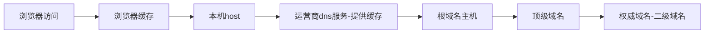

# DNS 解析原理

dns 是实现域名 -> ip 的网络协议，解析的步骤说起来不复杂。浏览器访问域名的时候需要通过 dns 解析



真正走到根域名那里的话会比较慢，特别是需要一层一层来回传输，所以 dns 只分了三层也就是我们常说的二级域名又称权威域名。再往下的三级、四级域名都通过这一层解析。

*chrome 浏览器 dns 缓存管理地址：chrome://net-internals/#dns*

那具体 dns 是怎么做到的呢？

[toc]

## 解析原理

dns 是应用层协议，协议内容传输通过 UDP 或者 TCP。由于 dns 解析并不关心通信的顺序和不那么关心稳定性而更加关心效率。所以我们一般选用 udp 协议实现。

DNS 服务器上存储着域名和 IP 对应关系的记录，我们使用云服务商的域名服务的时候也会选择使用哪类记录。

这些记录有 4 种类型：

- **A：域名对应的 IP**
- **CNAME：域名对应的别名**
- MX：邮件名后缀对应的域名或者 IP
- **NS：域名需要去另一个 DNS 服务器解析**，比如顶级域名服务器需要进一步去权威域名服务器解析
- PTR：IP 对应的域名

**当 DNS 服务器接收到 DNS 协议数据**就会去对应的记录表里查找对应的记录，然后通过 DNS 协议的格式返回。

#### dns 协议格式


- Transction ID 关联请求和响应用，和 http 中 sequence number 的作用相同

- Flags 是一些标志位

   

  - QR 是标识是请求还是响应
  - OPCODE 是标识是正向查询，也就是域名到 IP。还是反向查询，也就是 IP 到域名

**上面的每个数据占位都为 2 字节，所以如果药获取到真正的查询域名，需要从第 13 个字节开始！**

- **查询问题区域有三个属性**
  - `name` 查询的域名
  - `type `查询的记录类型
  - `class`查询类，目前都是 1，表示`internet`数据
- **回答区域和拥有查询相同的属性，但是额外增加了 TTL(time to live 缓存事件)、Data length(资源数据长度)、Data(资源数据，长度不固定)** 

#### 域名的存储形式

域名要注意，我们平常表示域名的时候是`xxx.xx.com`这种形式，但是在存储的时候是通过：

> **当前域长度 + 当前域内容 + 顶级域长度 + 顶级域内容 +  根域名长度 + 根域内容 + 0** 

以 0 作为域名的结尾。所以在通过 dns 协议内容做解析的时候要注意。

**最后看一下通过抓包工具抓到的 dns 协议内容长什么样**

 

大小一共 31 Byte 

了解了 dns 协议的内容之后就可以自己动手写一个 dns 服务了。

## 手写 dns 服务

先知道几个知识点

- dns 协议默认使用 53 端口，所以我们的服务要监听 53 端口
- 可以通过 node 提供的 `dgram` 类来创建 udp 服务

之后就可以根据上面说的 dns 协议的内容来解析 dns 发送过来的数据。如果是自定义顶级域名，可以使用逻辑判断，返回自己的主机地址。如果是外部域名可以转发到公共 dns 服务以获取数据。

主要步骤如下：

1. 通过 dgram.createSocket 创建一个 UDP 客户端，参数的 udp4 代表是 IPv4 的地址
2. 处理错误、监听消息，把 msg 转发给目标 DNS 服务器（经测试 google 的 8.8.8.8 是没问题的，国内的其他 dns 服务器似乎都不响应）
3. 收到返回的消息之后传递给客户端。
4. 客户端的 ip 和端口是通过参数`rinfo`传进来的

具体实现查看个人项目 projects -> node-dns-sever

#### dns 服务校验域名合规性-时序图

```sequence
title:域名合规性校验
用户->>node 服务:要校验的域名
node 服务->> node 服务: 向目标域名发起请求
node 服务->> node 服务: 监听 dns 端口请求
node 服务-> node 服务: 根据域名地址判断内部还是外部域名
node 服务-> node 服务: 获取 dns 解析结果
node 服务-->> 用户: 返回结果
```

## 参考文章

用 Node.js 手写一个 DNS 服务器：https://juejin.cn/post/7105620424368586782