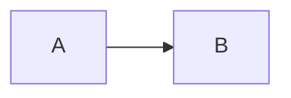

# markdown 使用

[toc]

记录一下老忘的 markdown 语法

## 常用格式

#### 列表

- [ ] 待办列表
- [x] 1
- [ ] 2

#### 链接

[github](https://github.com/)


#### 字体

~~删除线~~


## 特殊图表

#### 时序图 

**sequence** 

```sequence
title:时序图
A->B:请求
Note right of B: 我是 B
B-->A:返回
```

```text
- 代表实线 ， 主动发送消息，比如 request请求
> 代表实心箭头 ， 同步消息，比如 AJAX 的同步请求
-- 代表虚线，表示返回消息，spring Controller return
>> 代表非实心箭头 ，异步消息，比如AJAX请求
```

#### 流程图

**mermaid 样式流程图** 

- TB 从上到下
- BT 从下到上
- RL 从右到左
- LR 从左到右
- TD 同TB



**flow 标准流程图** 

- start 流程开始，以圆角矩形绘制
- opearation 操作，以直角矩形绘制
- condition 判断，以菱形绘制
- subroutine 子流程，以左右带空白框的矩形绘制
- inputoutput 输入输出，以平行四边形绘制
- end 流程结束，以圆角矩形绘制

```flow
st=>start: 开始
op=>operation: 操作
cond=>condition: 条件
st->op->cond
e=>end
cond(yes)->e
cond(no)->op
```

